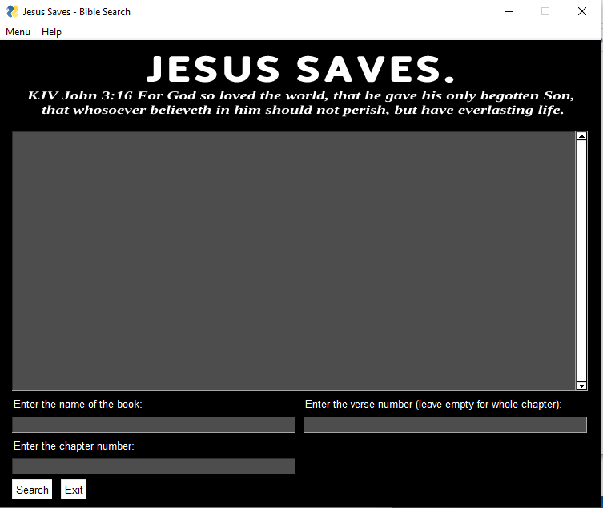

# KJV Bible Reader

A professional, modern web application for reading the King James Version (KJV) of the Holy Bible. Built with Next.js 14, TypeScript, and Tailwind CSS.


  

## ✨ Features

- **Complete KJV Bible**: Access all 66 books of the King James Version
- **Intuitive Navigation**: Easy-to-use interface for browsing books, chapters, and verses
- **Powerful Search**: Search through the entire Bible for specific words or phrases
- **Responsive Design**: Works seamlessly on desktop, tablet, and mobile devices
- **Dark Mode Support**: Automatic dark/light mode based on system preferences
- **Fast Performance**: Optimized with Next.js for quick loading and smooth navigation
- **Professional UI**: Clean, modern design with excellent readability

## 🚀 Quick Start

### Prerequisites

- Node.js 18+ and npm
- Git

### Installation

1. **Clone the repository**
   ```bash
   git clone https://github.com/yourusername/kjv-bible-reader.git
   cd kjv-bible-reader
   ```

2. **Install dependencies**
   ```bash
   npm install
   ```

3. **Run the development server**
   ```bash
   npm run dev
   ```

4. **Open your browser**
   Navigate to [http://localhost:3000](http://localhost:3000)

## 📖 Usage

### Reading the Bible

1. **Select a Book**: Choose from the list of 66 books in the left panel
2. **Choose a Chapter**: Select a chapter from the middle panel
3. **Read Verses**: View the verses in the right panel

### Searching

1. **Enter Search Terms**: Use the search bar at the top
2. **View Results**: Click on any result to jump to that verse
3. **Search Tips**:
   - Search for single words: "faith"
   - Search for phrases: "love thy neighbor"
   - Search is case-insensitive

## 🛠️ Development

### Available Scripts

- `npm run dev` - Start development server
- `npm run build` - Build for production
- `npm run start` - Start production server
- `npm run lint` - Run ESLint

### Project Structure

```
kjv-bible-reader/
├── src/
│   ├── app/
│   │   ├── layout.tsx      # Root layout
│   │   ├── page.tsx        # Home page
│   │   └── globals.css     # Global styles
│   ├── components/
│   │   ├── BibleReader.tsx # Main reader component
│   │   └── BibleSearch.tsx # Search functionality
│   └── data/
│       ├── kjv-data.json   # Parsed Bible data
│       └── parse-kjv.js    # Data parsing script
├── public/                 # Static assets
├── KJV-1611.pdf            # Raw KJV PDF file
└── package.json
```

### Data Processing

The Bible data is processed from `KJV-1611.pdf` into a structured JSON format:

```bash
node src/data/parse-kjv.js
```

This creates `src/data/kjv-data.json` with the following structure:
```json
{
  "books": ["Genesis", "Exodus", ...],
  "bible": {
    "Genesis": {
      "1": {
        "1": "In the beginning God created...",
        "2": "And the earth was without form..."
      }
    }
  }
}
```

## 🎨 Branding

The application features a professional logo and icon design:

- **Logo**: Elegant book design with gradient effects and serif typography
- **Favicon**: Scalable SVG icon for browser tabs
- **Apple Touch Icon**: Optimized icon for iOS devices
- **Color Scheme**: Blue gradient theme representing trust and knowledge

## 🎨 Customization

### Styling

The app uses Tailwind CSS for styling. Customize colors, fonts, and layout in:

- `src/app/globals.css` - Global styles and Tailwind imports
- `tailwind.config.js` - Tailwind configuration
- Component files - Inline Tailwind classes

### Adding Features

The app is built with modern React patterns:

- **Components**: Modular, reusable UI components
- **TypeScript**: Full type safety
- **Client Components**: Interactive features with `'use client'`
- **Data Import**: Static JSON data for fast loading

## 📱 Responsive Design

The app is fully responsive with breakpoints for:
- **Mobile**: Single column layout
- **Tablet**: Optimized spacing and touch targets
- **Desktop**: Three-column layout with scrollable panels

## 🌐 Deployment

### Vercel (Recommended)

1. Push to GitHub
2. Connect to Vercel
3. Deploy automatically

### Other Platforms

The app can be deployed to any platform supporting Next.js:
- Netlify
- Railway
- DigitalOcean App Platform

Build command: `npm run build`
Output directory: `.next`

## 🤝 Contributing

1. Fork the repository
2. Create a feature branch: `git checkout -b feature/amazing-feature`
3. Commit changes: `git commit -m 'Add amazing feature'`
4. Push to branch: `git push origin feature/amazing-feature`
5. Open a Pull Request

## 📄 License

This project is open source and available under the [MIT License](LICENSE).

## 🙏 Acknowledgments

- **KJV Text**: Public domain King James Version
- **Next.js**: The React framework for production
- **Tailwind CSS**: A utility-first CSS framework
- **Vercel**: For hosting and deployment

## 📞 Support

If you have questions or need help:

- Open an issue on GitHub
- Check the documentation
- Review the code comments

---

*"All scripture is given by inspiration of God, and is profitable for doctrine, for reproof, for correction, for instruction in righteousness."* - 2 Timothy 3:16</content>
<parameter name="filePath">d:\kjv-bible-viewer\README.md
=======
[](https://www.python.org/)

# KJV Bible Reader GUI

**Programmed in Python | PySimpleGUI**

[](https://github.com/adrijano/KJV-Bible-Reader-GUI/)

[](https://github.com/adrijano/KJV-Bible-Reader-GUI/graphs/commit-activity)

# If you like it give it a star

[](https://github.com/adrijano/KJV-Bible-Reader-GUI)



# How it works
```
The code is a Python program that allows users to search the King James Version (KJV) of the Bible. It provides a GUI where users can enter the name of the book, the chapter number, and optionally, the verse number, and the program displays the requested Bible passage.

The program reads the KJV text from a text file named 'KJV.txt' and stores it in a variable named 'bible'. The 'ver' function splits the text into verses and returns them as a list.

The program uses PySimpleGUI to create a GUI window. The 'create_main_window' function creates the main window with the necessary layout for user input and output. The 'create_settings_window' function creates a settings window where users can change the GUI theme.

The 'load_settings' and 'save_settings' functions load and save the GUI theme setting from and to a JSON settings file, respectively.

The 'main' function is the main entry point of the program. It contains a loop that continuously listens for user input events. If the user clicks the 'Exit' button or closes the window, the loop exits and the program terminates. If the user clicks the 'Search' button or presses Enter, the program attempts to retrieve the requested Bible passage and display it in the output area. If the user clicks the 'Copy' menu item, the selected text in the output area is copied to the clipboard. If the user clicks the 'About' menu item, a popup window with information about the program is displayed. If the user clicks the 'Settings' menu item, the settings window is displayed where the user can change the GUI theme.

In summary, this program is a simple GUI Bible search tool that allows users to retrieve passages from the KJV of the Bible. It uses PySimpleGUI to create a user-friendly interface and provides some basic functionality such as copying text to the clipboard and changing the GUI theme.

```
# How to use

### Python3+

```
git clone https://github.com/adrijano/KJV-Bible-Reader-GUI.git

cd KJV-Bible-Reader-GUI && pip install -r requirements.txt

python KJV-Bible-Reader-GUI.py
```
### Windows
```
cd dist 
KJV-Bible-Reader-GUI.exe
```

>>>>>>> 184699496c4b25022bc48997788c985536dfea18
